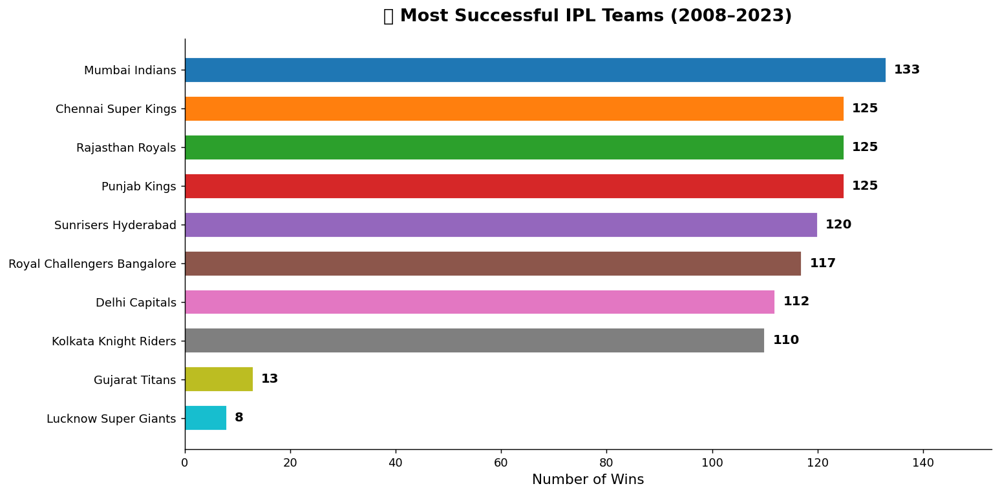
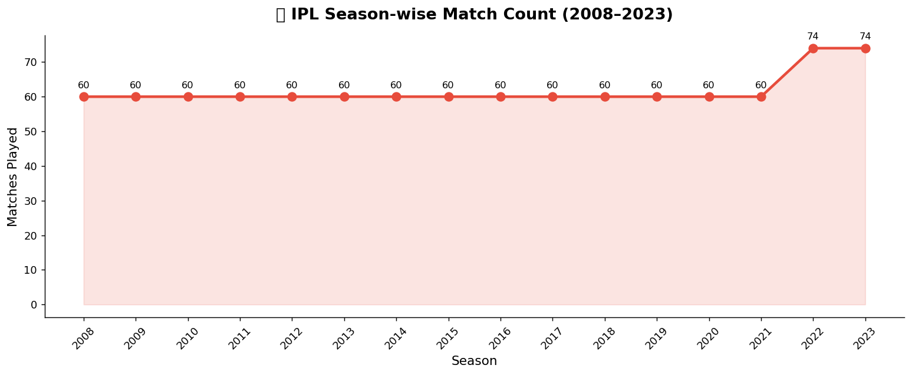
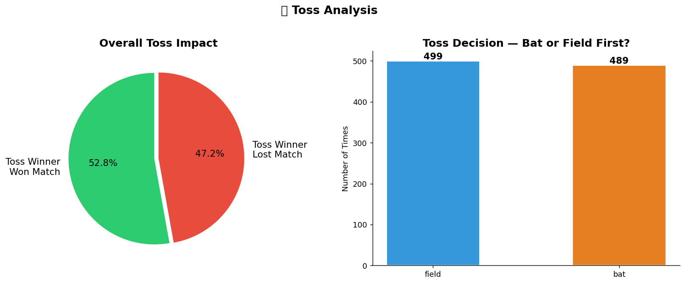
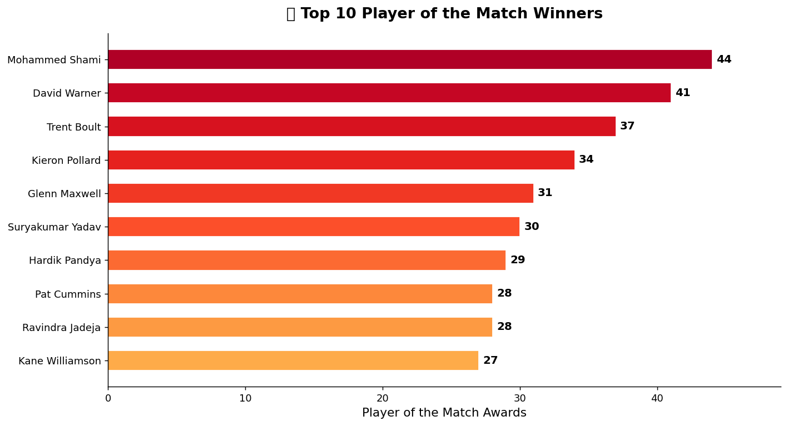
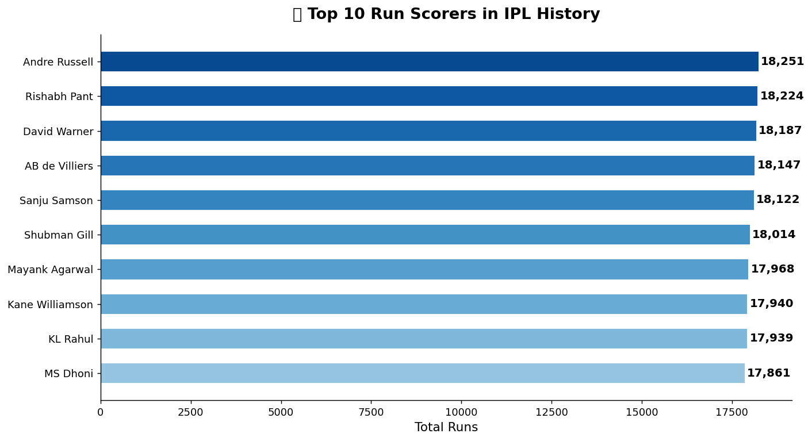
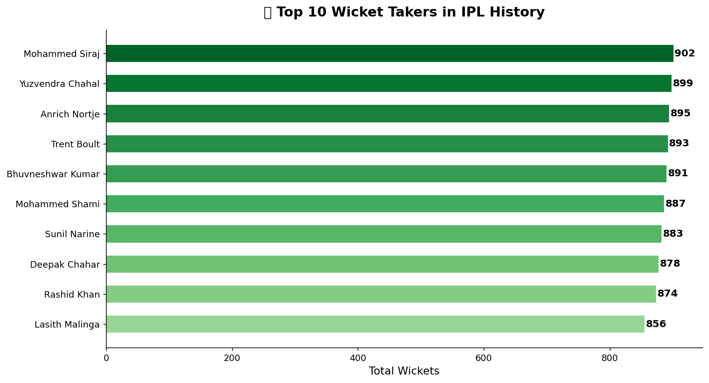
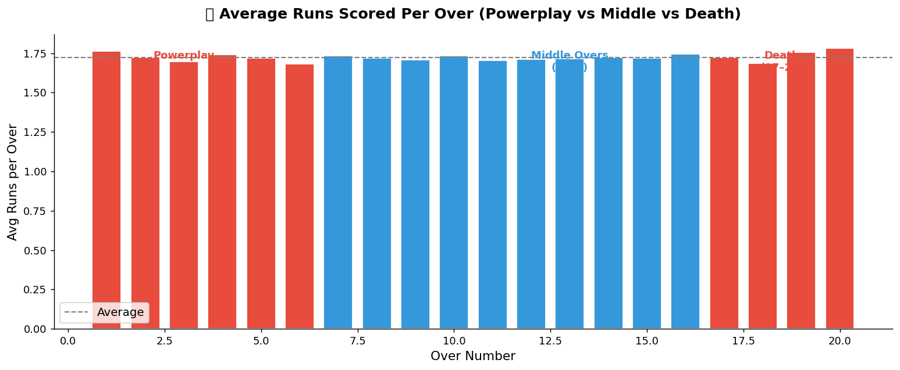
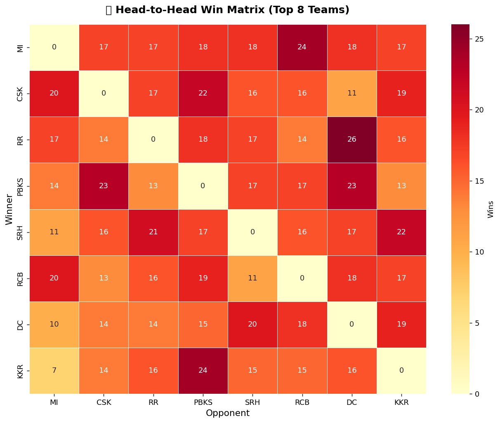
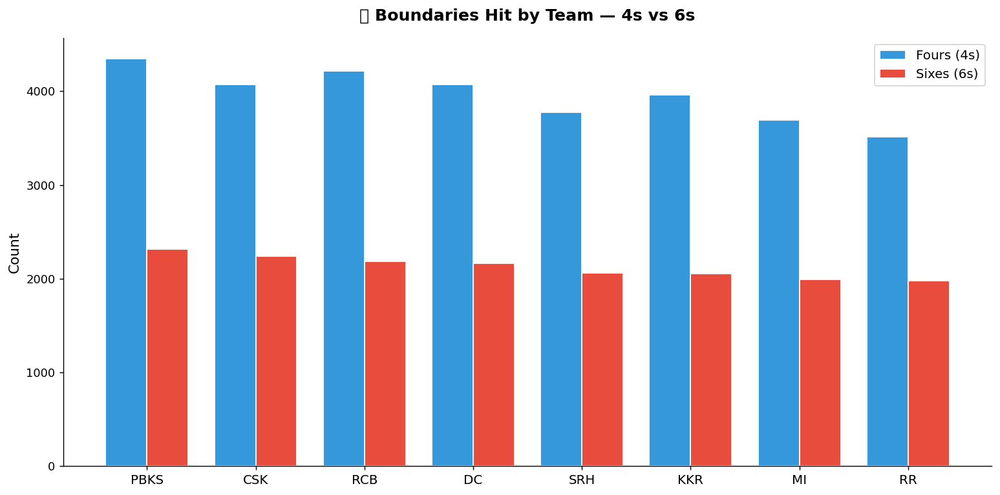

# 🏏 IPL Data Analysis (2008–2023)

<div align="center">


**A comprehensive data analysis of 16 IPL seasons (2008–2023) covering 988 matches and 2,17,000+ deliveries.**  
Explores team performance, player stats, toss impact, scoring patterns, and head-to-head records.

[📊 Analysis](#-analysis-covered) • [📈 Charts](#-charts--visualizations) • [🚀 Getting Started](#-getting-started) • [💡 Key Insights](#-key-insights)

</div>

---

## 🌟 About This Project

The Indian Premier League is one of the most data-rich sporting events in the world. This project dives deep into 16 seasons of IPL data to uncover patterns in team performance, player dominance, toss strategy, and match outcomes — using Python's data analysis and visualization stack.

> ✅ 988 matches analysed · ✅ 2,17,000+ ball-by-ball deliveries · ✅ 9 detailed visualizations

---

## 📊 Analysis Covered

| # | Analysis | Description |
|---|----------|-------------|
| 1 | **Team Win Count** | Most successful teams across all seasons |
| 2 | **Season Trends** | Match count growth season by season |
| 3 | **Toss Impact** | Does winning the toss help win the match? |
| 4 | **Player of the Match** | Top award winners across all seasons |
| 5 | **Top Run Scorers** | Highest run-getters in IPL history |
| 6 | **Top Wicket Takers** | Leading wicket-takers across all seasons |
| 7 | **Scoring Rate** | Average runs per over — Powerplay vs Middle vs Death |
| 8 | **Head-to-Head** | Win matrix heatmap for top 8 teams |
| 9 | **Boundaries** | 4s vs 6s comparison by team |

---

## 📈 Charts & Visualizations

### 🏆 Most Successful Teams — All Time Win Count


---

### 📅 Season-wise Match Count (2008–2023)


---

### 🪙 Toss Impact Analysis


---

### ⭐ Top 10 Player of the Match Winners


---

### 🏏 Top 10 Run Scorers in IPL History


---

### 🎳 Top 10 Wicket Takers in IPL History


---

### 📈 Average Runs Per Over — Powerplay vs Middle vs Death


---

### 🔥 Head-to-Head Win Matrix (Top 8 Teams)


---

### 💥 Boundaries — 4s vs 6s by Team


---

## 💡 Key Insights

- **Mumbai Indians** are the most successful IPL team across all seasons
- Toss winner wins the match only ~**50%** of the time — toss is not a major advantage
- **Death overs (17–20)** have the highest scoring rate per over
- **Powerplay overs (1–6)** are more aggressive than middle overs
- A small set of players dominate both batting and POTM awards consistently

---

## 🏗️ Tech Stack

| Library | Purpose |
|---------|---------|
| **Pandas** | Data loading, cleaning, grouping, merging |
| **NumPy** | Numerical operations |
| **Matplotlib** | Core charting and visualization |
| **Seaborn** | Statistical plots — heatmaps, styled charts |
| **Jupyter Notebook** | Interactive analysis environment |

---

## 📁 Project Structure

```
IPL-Data-Analysis/
├── IPL_Analysis.ipynb      # Main Jupyter Notebook (all analysis + charts)
├── requirements.txt
├── data/
│   ├── matches.csv         # 988 IPL matches (2008–2023)
│   └── deliveries.csv      # 2,17,000+ ball-by-ball delivery data
└── charts/                 # All generated chart images (PNG)
    ├── 01_team_wins.png
    ├── 02_season_matches.png
    ├── 03_toss_analysis.png
    ├── 04_top_players.png
    ├── 05_top_batsmen.png
    ├── 06_top_bowlers.png
    ├── 07_runs_per_over.png
    ├── 08_h2h_heatmap.png
    └── 09_boundaries.png
```

---

## 🚀 Getting Started

### Prerequisites
- Python 3.9 or above
- Jupyter Notebook

### Installation

```bash
# 1. Clone the repository
git clone https://github.com/tripathik9559/IPL-Data-Analysis.git
cd IPL-Data-Analysis

# 2. Create virtual environment
python -m venv venv

# 3. Activate
# Windows:
venv\Scripts\activate
# Mac/Linux:
source venv/bin/activate

# 4. Install dependencies
pip install -r requirements.txt

# 5. Launch Jupyter
jupyter notebook --notebook-dir="."
```

### Run
Open `IPL_Analysis.ipynb` → `Kernel` → `Restart and Run All Cells`

---

## 📋 Dataset Info

| File | Rows | Columns | Description |
|------|------|---------|-------------|
| `matches.csv` | 988 | 12 | Match-level data — teams, venue, toss, winner, POTM |
| `deliveries.csv` | 2,17,233 | 10 | Ball-by-ball data — batsman, bowler, runs, wickets |

---

## 📄 License

This project is licensed under the MIT License.

---

## 👨‍💻 Author

**Kartikey Kumar Tripathi**  
🔗 [GitHub](https://github.com/tripathik9559)

---

<div align="center">

**⭐ If this project was useful, please give it a star! ⭐**

*Built with ❤️ using Python's data analysis stack.*

</div>
